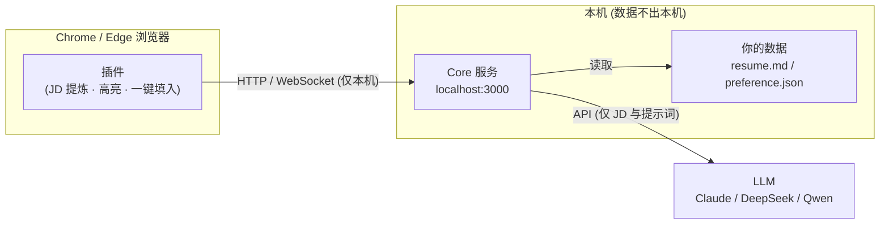

# Tomi-Job-Hunt 🎯

> AI 求职助手：让 AI 帮你筛选岗位、定制简历、生成高回复率打招呼语。
> **所有数据留在本地，隐私由你掌控。**

[English](#english) | [License](#license)

## 痛点

- Boss 直聘 / 猎聘上岗位太多，人工筛选耗时；很多岗位与你的经历匹配度不高
- 海投简历没有针对性，HR 回复率低
- 打招呼语千篇一律，无法直击 JD 核心要求
- 不放心把个人简历交给云端求职工具

## 解决方案

Tomi-Job-Hunt 由两部分组成，全部跑在你的电脑上：

- **浏览器插件**（Chrome / Edge）：自动提炼 Boss 直聘 / 猎聘岗位详情，列表页快速打分降噪，聊天框一键填入 AI 生成的话术
- **本地 Core 服务**：基于 Claude Code 的本地 AI 引擎，负责简历解析、匹配度打分、话术与定制简历生成



## ✨ 功能路线图

- [x] **阶段 0** — 项目基础 + 本地 Core 服务 + LLM 多 Provider 接入
- [ ] **阶段 1** — 插件单页抓取（Boss 直聘 / 猎聘）+ 100 字高回复率打招呼语
- [ ] **阶段 2** — 简历配置 + JD 匹配度打分（0-100）+ 定制简历改写（PDF/Word 导出）
- [ ] **阶段 3** — 列表页降噪过滤 + AI 快速打分标签 + 面试提问准备
- [ ] **阶段 4** — RSS/小众渠道聚合 + 求职看板 + 国产大模型切换面板

## 🚀 快速开始

### 前置要求

- Node.js ≥ 20
- 一个 LLM API Key（Claude API Key，或后续版本支持的 DeepSeek / Qwen）

### 1. 安装

```bash
git clone https://github.com/<your-name>/tomi-job-hunt.git
cd tomi-job-hunt
npm install
```

### 2. 配置

创建本机配置目录（也可以只用环境变量，见 [.env.example](.env.example)）：

```bash
mkdir -p ~/.tomi-job-hunt
```

编辑 `~/.tomi-job-hunt/config.json`：

```json
{
  "provider": "claude-code",
  "model": "claude-sonnet-5",
  "concurrency": 2
}
```

设置 API Key：

```bash
export ANTHROPIC_API_KEY=sk-ant-...
```

### 3. 启动

```bash
npm run dev -w core
```

验证服务：

```bash
curl http://127.0.0.1:3000/health
# {"ok":true}

curl -X POST http://127.0.0.1:3000/v1/chat \
  -H "Content-Type: application/json" \
  -d '{"messages":[{"role":"user","content":"用一句话介绍你自己"}]}'
```

浏览器插件将在阶段 1 提供（`extension/`）。

## 🔒 隐私声明

- **你的简历、偏好设置、浏览记录全部保存在本机**，Core 服务只绑定 `127.0.0.1`，不对外网开放
- 仅岗位描述（JD）与必要的提示词会发送给你选择的 LLM API
- 无遥测、无统计上报、无云端服务器。详见 [docs/privacy.md](docs/privacy.md)

## 📁 项目结构

```
core/       本地 Core 服务（TypeScript · Hono · LLM Provider 抽象层）
extension/  浏览器插件（Chrome/Edge MV3，阶段 1 开发）
docs/       架构与隐私文档
```

## 🤝 贡献

欢迎贡献！请先阅读 [CONTRIBUTING.md](CONTRIBUTING.md)。

## 📄 License

[MIT](LICENSE) © 2026 Tomi-Job-Hunt contributors

---

## English

Tomi-Job-Hunt is an AI-powered job-hunting assistant for the Chinese job
market (Boss直聘 / 猎聘). A browser extension extracts job descriptions and
sends them to a **local** Core service that scores fit, tailors your resume,
and writes high-response-rate greeting messages using Claude Code.

**Everything runs on your machine.** No cloud servers, no telemetry — only
the JD text and prompts you choose to send reach your LLM API.

- **Quick start**: `npm install && npm run dev -w core`, then set
  `ANTHROPIC_API_KEY` and call `POST /v1/chat` on `http://127.0.0.1:3000`.
- **Status**: Phase 0 (core service + LLM providers). Browser extension
  arrives in Phase 1. See the roadmap above.
- **Privacy**: see [docs/privacy.md](docs/privacy.md).

## License

[MIT](LICENSE) © 2026 Tomi-Job-Hunt contributors
