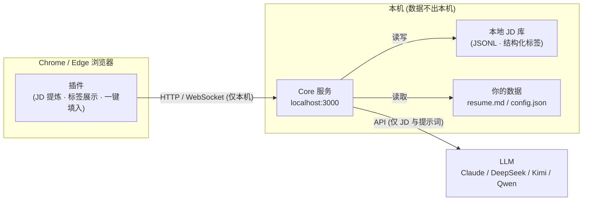

# TomiHunt 🎯

> AI 求职雷达：本地语义标签、匹配度评分、高回复率打招呼语、去中心化求职情报网。
> **所有数据留在本地，隐私由你掌控。**

[English](#english) | [使用指南](docs/usage.md) | [法律与合规](#法律与合规) | [License](#license)

## 痛点

招聘平台本质是「卖曝光位的商业地产商」：搜索只能匹配公司名/岗位名、优质 JD 藏在付费曝光之后、求职者被困在盲目刷列表的消耗战里。

- 平台不让搜深层需求（「不用加班、懂 RAG、学历要求不严」搜不出来）
- 信息不对称：薪资虚标、外包伪装、挂职不招无法识别
- 海投简历没有针对性，HR 回复率低
- 不放心把个人简历交给云端求职工具

## 解决方案

TomiHunt 全部跑在你的电脑上，用 AI + 社区打破信息壁垒：

- **浏览器插件**（Chrome / Edge）：自动提炼 Boss 直聘 / 猎聘岗位详情，AI 结构化标签（技术栈/工时/风险词），打招呼语一键填入聊天框
- **本地 Core 服务**：本地 JD 库 + LLM 标签化 + 话术生成（支持 Claude / DeepSeek / Kimi / Qwen，自由切换）
- **去中心化情报网**（规划中）：匿名共享结构化求职情报（真实薪资、外包黑榜），零注册、零服务器



## ✨ 功能路线图

- [x] **阶段 0** — 项目基础 + 本地 Core 服务 + LLM 多 Provider 接入
- [x] **数据地基** — 统一 JD/情报 Schema + 本地 JD 库 + LLM 结构化标签 + PII 脱敏管线 + 合规文档
- [x] **阶段 1** — 插件闭环：Boss 直聘 JD 提取 + 打招呼语 + 聊天框一键填入；猎聘提取
- [ ] **阶段 2** — 本地语义搜索（标签粗筛 + LLM 重排）+ JD 匹配度打分 + 定制简历改写
- [ ] **阶段 3** — 列表页降噪过滤 + AI 快速打分标签 + 面试提问准备
- [ ] **阶段 4** — 隐形流量池雷达（HN/V2EX/GitHub）+ 求职看板 + 模型切换面板
- [ ] **阶段 5** — 去中心化情报网（仓库 Feed → Nostr → Worker 聚合）
- [ ] **阶段 6** — 反向求职引擎（目标公司图谱 + 直连投递）

## 🚀 快速开始

**前置要求**：Node.js ≥ 20、Chrome/Edge、任一 LLM API Key（Claude / DeepSeek / Kimi / Qwen）

```bash
# 1. 安装
git clone https://github.com/<your-name>/tomi-job-hunt.git
cd tomi-job-hunt && npm install

# 2. 配置 LLM（选一家，示例为 DeepSeek）
mkdir -p ~/.tomi-job-hunt
cp config.example.json ~/.tomi-job-hunt/config.json
#   编辑 config.json：填 provider / model / apiKey

# 3. 配置简历（可选，强烈建议——话术质量的关键）
cp docs/resume.template.md ~/.tomi-job-hunt/resume.md

# 4. 启动本地 Core 服务
npm start -w core
#   验证：curl http://127.0.0.1:3000/health → {"ok":true,...}

# 5. 构建插件并加载
npm run build -w extension
#   打开 chrome://extensions → 开发者模式 → 加载已解压 → 选择 extension/dist/
```

然后打开任意 Boss 直聘岗位详情页：右下角 🤖 TomiHunt 面板自动导入 JD →
AI 结构化标签 → 生成打招呼语 → 立即沟通 → 聊天页一键填入。

**详细说明**（配置项参考、环境变量、API 列表、FAQ）见 [docs/usage.md](docs/usage.md)。

## 🔒 隐私声明

- **你的简历、偏好设置、浏览记录全部保存在本机**，Core 服务只绑定 `127.0.0.1`，不对外网开放
- 仅岗位描述（JD）与必要的提示词会发送给你选择的 LLM API
- 无遥测、无统计上报、无云端服务器。详见 [docs/privacy.md](docs/privacy.md)

## ⚖️ 法律与合规

TomiHunt 是**用户端本地增强工具**：只解析你正在浏览的页面，不做批量爬取；共享管线在代码层面硬性排除原始 JD 文本与个人信息（`buildSharedIntel` 只允许结构化标签与事实通过）。

- 免责声明与合规设计：[docs/LEGAL.md](docs/LEGAL.md)
- 侵权内容通知-删除流程：[TAKEDOWN_POLICY.md](TAKEDOWN_POLICY.md)

## 📁 项目结构

```
core/       本地 Core 服务（TypeScript · Hono · LLM Provider · JD 库/标签化/脱敏）
extension/  浏览器插件（Chrome/Edge MV3 · Vite）
docs/       使用指南、架构、隐私与合规文档
```

## 🤝 贡献

欢迎贡献！请先阅读 [CONTRIBUTING.md](CONTRIBUTING.md)。

## 📄 License

[MIT](LICENSE) © 2026 Tomi-Job-Hunt contributors

---

## English

TomiHunt is an AI-powered job-hunting assistant for the Chinese job market
(Boss直聘 / 猎聘). A browser extension extracts job descriptions and sends
them to a **local** Core service that tags them with structured metadata and
writes high-response-rate greeting messages. Provider-agnostic: Claude,
DeepSeek, Kimi and Qwen all work out of the box. A decentralized,
accountless community-intel feed (structured facts only — never raw JD text)
is on the roadmap.

**Everything runs on your machine.** No cloud servers, no telemetry — only
the JD text and prompts you choose to send reach your LLM API.

- **Quick start**: `npm install`, copy `config.example.json` to
  `~/.tomi-job-hunt/config.json` and set a provider, then
  `npm start -w core` and `npm run build -w extension` (load `extension/dist/`
  unpacked). Full guide: [docs/usage.md](docs/usage.md).
- **Status**: Phases 0-1 shipped — Core service, JD store + LLM tagging,
  sanitize pipeline, and the extension MVP (zhipin closed loop + liepin
  extraction). See the roadmap above.
- **Privacy**: [docs/privacy.md](docs/privacy.md). **Legal**:
  [docs/LEGAL.md](docs/LEGAL.md) and [TAKEDOWN_POLICY.md](TAKEDOWN_POLICY.md).

## License

[MIT](LICENSE) © 2026 Tomi-Job-Hunt contributors
