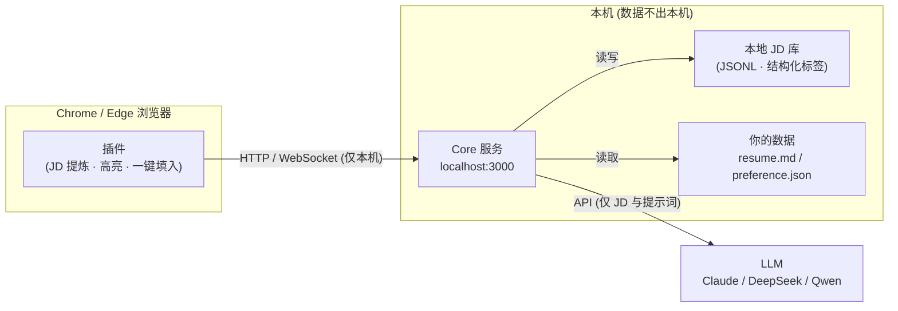

# TomiHunt 🎯

> AI 求职雷达：本地语义搜索、匹配度评分、高回复率打招呼语、去中心化求职情报网。
> **所有数据留在本地，隐私由你掌控。**

[English](#english) | [法律与合规](#法律与合规) | [License](#license)

## 痛点

招聘平台本质是「卖曝光位的商业地产商」：搜索只能匹配公司名/岗位名、优质 JD 藏在付费曝光之后、求职者被困在盲目刷列表的消耗战里。

- 平台不让搜深层需求（「不用加班、懂 RAG、学历要求不严」搜不出来）
- 信息不对称：薪资虚标、外包伪装、挂职不招无法识别
- 海投简历没有针对性，HR 回复率低
- 不放心把个人简历交给云端求职工具

## 解决方案

TomiHunt 全部跑在你的电脑上，用 AI + 社区打破信息壁垒：

- **浏览器插件**（Chrome / Edge）：提炼 Boss 直聘 / 猎聘岗位详情，列表页打分降噪，聊天框一键填入 AI 话术
- **本地 Core 服务**：本地 JD 库 + 语义标签化 + 匹配度打分 + 话术/简历生成（基于 Claude Code）
- **去中心化情报网**（规划中）：匿名共享结构化求职情报（真实薪资、外包黑榜），零注册、零服务器



## ✨ 功能路线图

- [x] **阶段 0** — 项目基础 + 本地 Core 服务 + LLM 多 Provider 接入
- [x] **数据地基** — 统一 JD/情报 Schema + 本地 JD 库 + LLM 结构化标签 + PII 脱敏管线 + 合规文档
- [ ] **阶段 1** — 插件单页抓取（Boss 直聘闭环 / 猎聘提取）+ 100 字高回复率打招呼语
- [ ] **阶段 2** — 本地语义搜索（标签粗筛 + LLM 重排）+ JD 匹配度打分 + 定制简历改写
- [ ] **阶段 3** — 列表页降噪过滤 + AI 快速打分标签 + 面试提问准备
- [ ] **阶段 4** — 隐形流量池雷达（HN/V2EX/GitHub）+ 求职看板 + 模型切换面板
- [ ] **阶段 5** — 去中心化情报网（仓库 Feed → Nostr → Worker 聚合）
- [ ] **阶段 6** — 反向求职引擎（目标公司图谱 + 直连投递）

## 🚀 快速开始

### 前置要求

- Node.js ≥ 20
- 一个 LLM API Key（Claude API Key，或后续版本支持的 DeepSeek / Qwen）

### 1. 安装

```bash
git clone https://github.com/<your-name>/tomi-job-hunt.git
cd tomi-job-hunt
npm install
```

### 2. 配置

创建本机配置目录（也可以只用环境变量，见 [.env.example](.env.example)）：

```bash
mkdir -p ~/.tomi-job-hunt
```

编辑 `~/.tomi-job-hunt/config.json`：

```json
{
  "provider": "claude-code",
  "model": "claude-sonnet-5",
  "concurrency": 2
}
```

设置 API Key：

```bash
export ANTHROPIC_API_KEY=sk-ant-...
```

### 3. 启动

```bash
npm run dev -w core
```

验证服务：

```bash
curl http://127.0.0.1:3000/health
# {"ok":true}

curl -X POST http://127.0.0.1:3000/v1/chat \
  -H "Content-Type: application/json" \
  -d '{"messages":[{"role":"user","content":"用一句话介绍你自己"}]}'
```

抓取岗位并自动打结构化标签（异步完成，通过 `/ws` 推送结果）：

```bash
curl -X POST http://127.0.0.1:3000/v1/jd/capture \
  -H "Content-Type: application/json" \
  -d '{"source":"manual","url":"https://example.com/job/1","title":"高级后端工程师","company":"某某科技","salaryText":"20-30K·14薪","requirements":"熟悉 Java、K8s，3-5 年经验，本科以上"}'
```

浏览器插件将在阶段 1 提供（`extension/`）。

## 🔒 隐私声明

- **你的简历、偏好设置、浏览记录全部保存在本机**，Core 服务只绑定 `127.0.0.1`，不对外网开放
- 仅岗位描述（JD）与必要的提示词会发送给你选择的 LLM API
- 无遥测、无统计上报、无云端服务器。详见 [docs/privacy.md](docs/privacy.md)

## ⚖️ 法律与合规

TomiHunt 是**用户端本地增强工具**：只解析你正在浏览的页面，不做批量爬取；共享管线在代码层面硬性排除原始 JD 文本与个人信息（`buildSharedIntel` 只允许结构化标签与事实通过）。

- 免责声明与合规设计：[docs/LEGAL.md](docs/LEGAL.md)
- 侵权内容通知-删除流程：[TAKEDOWN_POLICY.md](TAKEDOWN_POLICY.md)

## 📁 项目结构

```
core/       本地 Core 服务（TypeScript · Hono · LLM Provider · JD 库/标签化/脱敏）
extension/  浏览器插件（Chrome/Edge MV3，阶段 1 开发）
docs/       架构、隐私与合规文档
```

## 🤝 贡献

欢迎贡献！请先阅读 [CONTRIBUTING.md](CONTRIBUTING.md)。

## 📄 License

[MIT](LICENSE) © 2026 Tomi-Job-Hunt contributors

---

## English

TomiHunt is an AI-powered job-hunting assistant for the Chinese job market
(Boss直聘 / 猎聘). A browser extension extracts job descriptions and sends
them to a **local** Core service that tags them with structured metadata,
scores fit, tailors your resume, and writes high-response-rate greeting
messages using Claude Code. A decentralized, accountless community-intel
feed (structured facts only — never raw JD text) is on the roadmap.

**Everything runs on your machine.** No cloud servers, no telemetry — only
the JD text and prompts you choose to send reach your LLM API.

- **Quick start**: `npm install && npm run dev -w core`, then set
  `ANTHROPIC_API_KEY` and call `POST /v1/chat` on `http://127.0.0.1:3000`.
- **Status**: Phase 0 + data foundation (JD store, LLM tagging, sanitize
  pipeline). Browser extension arrives in Phase 1. See the roadmap above.
- **Privacy**: see [docs/privacy.md](docs/privacy.md). **Legal**:
  [docs/LEGAL.md](docs/LEGAL.md) and [TAKEDOWN_POLICY.md](TAKEDOWN_POLICY.md).

## License

[MIT](LICENSE) © 2026 Tomi-Job-Hunt contributors
