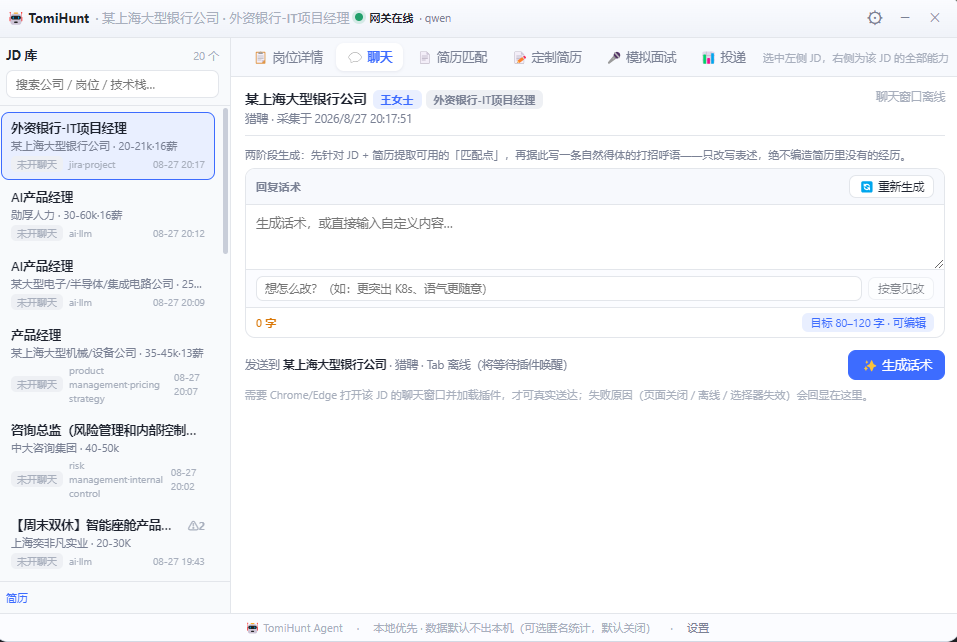
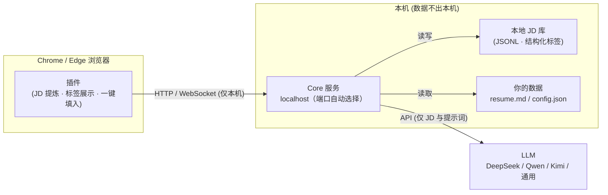

# TomiHunt 🎯

> AI 求职雷达：本地语义标签、匹配度评分、高回复率打招呼语、去中心化求职情报网。
> **所有数据留在本地，隐私由你掌控。**

> ⭐ **觉得这个工具对你有帮助？点个 Star 支持一下**，让更多正在求职的朋友看到它 →
> [⭐ 给 TomiHunt 一个 Star](https://github.com/xxwj225-James/tomi-job-hunt)

[English](#english) | [使用指南](docs/usage.md) | [法律与合规](#法律与合规) | [License](#license)

## 📸 界面预览

桌面 Agent（Windows）主界面预览 —— 左侧 JD 库，右侧是选中岗位的全部能力；配合浏览器插件后，浏览岗位即自动沉淀到本地 JD 库。



## 痛点

招聘平台本质是「卖曝光位的商业地产商」：搜索只能匹配公司名/岗位名、优质 JD 藏在付费曝光之后、求职者被困在盲目刷列表的消耗战里。

- 平台不让搜深层需求（「不用加班、懂 RAG、学历要求不严」搜不出来）
- 信息不对称：薪资虚标、外包伪装、挂职不招无法识别
- 海投简历没有针对性，HR 回复率低
- 不放心把个人简历交给云端求职工具

## 解决方案

TomiHunt 全部跑在你的电脑上，用 AI + 社区打破信息壁垒：

- **桌面 Agent**（Windows）：一键安装、内置一切——悬浮对话窗 + Core 服务 + 浏览器插件 + 自动更新，只差你一个 API Key
- **浏览器插件**（Chrome / Edge）：自动提炼 Boss 直聘 / 猎聘岗位详情，AI 结构化标签（技术栈/工时/风险词），打招呼语一键填入聊天框
- **本地 Core 服务**：本地 JD 库 + LLM 标签化 + 话术生成（DeepSeek / Qwen / Kimi / 任意 OpenAI 兼容端点，自由切换）
- **去中心化情报网**（规划中）：匿名共享结构化求职情报（真实薪资、外包黑榜），零注册、零服务器



## ✨ 功能路线图

- [x] **阶段 0** — 项目基础 + 本地 Core 服务 + LLM 多 Provider 接入
- [x] **数据地基** — 统一 JD/情报 Schema + 本地 JD 库 + LLM 结构化标签 + PII 脱敏管线 + 合规文档
- [x] **阶段 1** — 插件闭环：Boss 直聘 JD 提取 + 打招呼语 + 聊天框一键填入；猎聘提取
- [x] **阶段 2** — 本地语义搜索（意图翻译 + 标签粗筛 + LLM 重排）+ 匹配度打分（0-100 诊断）+ 定制简历改写（MD/Word 导出）
- [x] **阶段 3** — 列表页降噪过滤（风险词规则）+ 卡片 AI 打分 + 面试提问准备（STAR 建议）
- [x] **阶段 4** — 隐形流量池雷达（HN/V2EX/GitHub → 每日日报）+ 求职看板（本地 Markdown Kanban）+ 多模型切换
- [x] **阶段 5** — 去中心化情报网（仓库 Feed 导出 + 结构化 Issue 模板 + Nostr 发布/订阅 + 可选 Cloudflare Worker 中转）
- [x] **阶段 6** — 反向求职引擎（目标公司图谱 + 直连自荐冷邮件）

> ⚠️ 插件侧（阶段 1/3）已在 fixture 层测试，但 Boss 直聘/猎聘真实页面的选择器建议按 [extension/README.md](extension/README.md) 实测一轮。

## 🚀 快速开始

### 第 0 步：申请一个 LLM API Key（自备，费用由你的 Key 承担）

TomiHunt 永久免费开源、不含内置模型 Key。**只需自己到一家服务商申请 API Key**，粘贴进 App 即可用：

| 服务商 | 说明 | 申请入口 |
|---|---|---|
| **DeepSeek**（默认，性价比高） | 话术 / 匹配 / 定制全覆盖 | [platform.deepseek.com](https://platform.deepseek.com) → 注册 → 充值 → API Keys → 创建 |
| **Kimi（月之暗面）** | 同上 | [platform.moonshot.cn](https://platform.moonshot.cn) → API Keys |
| **通义千问 Qwen**（阿里云百炼） | 同上 | [bailian.console.aliyun.com](https://bailian.console.aliyun.com) → API-KEY 管理 |

> 💡 各平台新用户一般有赠送额度，可先零成本体验。API Key 只保存在你本机（系统加密存储），App 不上传、不经过任何服务器。

### 方式一：桌面 Agent ＋ 浏览器插件（推荐 · Windows · 完整体验）

**Agent 是中枢，插件是它在浏览器里的手——两者一起用才是 TomiHunt 的完整形态。**
App 一键安装，Core 服务、插件、自动更新全部内置，全程无需命令行：

1. 从 [Releases](https://github.com/xxwj225-James/tomi-job-hunt/releases) 下载最新的 **`TomiHuntSetup-<版本>.exe`** 并安装
2. 打开 **TomiHunt Agent** → ⚙ **设置** → 粘贴第 0 步的 API Key → **保存**（保存时自动测试连接）
3. 设置 → **浏览器插件** → 点 **「打开扩展页」**（Chrome/Edge 不允许程序自动跳转其内部页，因此不会重启浏览器：点一下会打开/激活浏览器并把 `chrome://extensions` 复制到剪贴板，在地址栏 Ctrl+L 粘贴回车即可到达；主窗口顶部也常驻这两个按钮）→ 开「开发者模式」→「加载已解压的扩展程序」→ 选择插件目录 `%LOCALAPPDATA%\TomiHunt\extension`（可点 **「打开插件目录」** 直接定位它）
4. 回到 App，列表出现 **「● 在线」** 即插件已联通——之后你在 Boss 直聘 / 猎聘浏览岗位时，插件负责**自动提炼 JD**，Agent 负责**沉淀到本地 JD 库、匹配打分、主动推荐、生成话术**并回填聊天框
5. 生成的话术填入聊天框 → **你确认后手动发送**

> 单靠插件能完成核心闭环，但没有 Agent 的 JD 库沉淀 / 匹配 / 看板 / 面试准备等能力，也不享受 App 自动更新。想要完整体验请用方式一。
> App 支持 GitHub Releases 自动更新；插件固定在上述目录，App 更新后到扩展页点 🔄 刷新即可（浏览器不允许外部程序静默重装插件）。

### 方式二：仅浏览器插件（轻量子集 —— 仅限无法安装 App 的场景）

**不推荐作为日常主路径。** 只有当你用的是 **macOS / Linux**（桌面 App 目前仅 Windows），或确实不想安装 App 时，才用纯插件：下载 Releases 的 `tomihunt-extension.zip` → 解压 → 双击 `install-extension.bat` → 点工具栏 🤖 图标 → ⚙ 设置 → 粘贴 API Key。覆盖核心闭环（JD 提炼、AI 标签、打招呼语、匹配打分、面试准备），但**缺少 JD 库沉淀、求职看板、岗位雷达等 Agent 能力**。

### 方式三：源码运行（开发者 / macOS / Linux）

```bash
git clone https://github.com/xxwj225-James/tomi-job-hunt.git
cd tomi-job-hunt && npm install

# —— 桌面 App（Electron，仅 Windows 打包，源码可跨平台跑）——
npm run dev -w app

# —— 或 纯 Core 服务 + 插件 ——
mkdir -p ~/.tomi-job-hunt && cp config.example.json ~/.tomi-job-hunt/config.json
#   编辑 config.json：填 provider / model / apiKey
cp docs/resume.template.md ~/.tomi-job-hunt/resume.md     # 可选但强烈建议（话术质量关键）
npm start -w core                                         # Windows 也可双击 start.bat
npm run build -w extension                                # 然后 chrome://extensions 加载 extension/dist/
```

插件会自动探测本地 Core：在线走完整功能，离线自动退回直连模式。

**详细说明**（配置项、环境变量、API 列表、FAQ）见 [docs/usage.md](docs/usage.md)。

## 🔒 隐私声明

- **你的简历、偏好设置、浏览记录全部保存在本机**，Core 服务只绑定 `127.0.0.1`，不对外网开放
- 仅岗位描述（JD）与必要的提示词会发送给你选择的 LLM API
- 默认无遥测、无统计上报：桌面 Agent 设置 → 应用 → 「帮助改进 TomiHunt」**默认关闭**。开启后仅在本地记录各功能使用次数，并按天合并成一份**匿名纯计数**上报（每台设备一个随机 ID + 功能名与次数，**不含简历 / JD / 聊天内容**），可随时关闭并清除本机计数；纯插件轻量子集（直连模式）无此开关、也不采集任何数据
- 匿名计数默认发往作者自建统计端点 `https://tomatovector.com/api/tomihunt-usage`（只存按天聚合、可供作者改进产品）；自托管用户可用环境变量 `TOMI_TELEMETRY_URL` 或 `~/.tomi-job-hunt/telemetry.json` 的 `collectorUrl` 指向自己的 collector（参考仓库内 [cloudflare/worker.js](cloudflare/worker.js) 的 `/usage` 路由）。详见 [docs/privacy.md](docs/privacy.md) 与 [docs/telemetry.md](docs/telemetry.md)

## 🔄 自动更新（OTA）

- **桌面 App**：electron-updater 走 GitHub Releases（启动后 + 每 4 小时检查；设置 → 关于 → 检查更新 / 下载 / 重启安装）
- **插件**：每次打开 popup 检查仓库 `version.json`（每日一次）；App 用户到扩展页点 🔄 刷新
- **纯源码模式（Core）**：`start.bat` 每次启动前 `git pull`；`/health` 与 setup 页显示版本
- 将来插件上架 Chrome 商店后由浏览器自动静默更新

## 💝 支持项目

TomiHunt 永久免费开源（MIT 协议）、默认不收集任何数据（可选匿名用量统计默认关闭，开启才上报纯功能计数）。觉得有用的话，请作者喝杯咖啡 ☕：[爱发电](https://afdian.com/a/jameswu)

### 云服务推广（返佣链接）

> ⚠️ 透明披露：以下链接带有推广返佣——你通过它们购买云服务，作者会获得少量佣金，**你的价格与直接购买完全一致**。

- **阿里云**：[https://www.aliyun.com/minisite/goods?userCode=x4jbzcb6](https://www.aliyun.com/minisite/goods?userCode=x4jbzcb6)（推广码 `x4jbzcb6`，注册/购买时填写）— 使用 **Qwen（通义千问）** 需要阿里云百炼账号；部署情报聚合 Worker 也可用阿里云函数计算
- **腾讯云**：[https://curl.qcloud.com/9QREcs1T](https://curl.qcloud.com/9QREcs1T) — 云服务器、轻量应用服务器（如需远程部署 Core 服务）

### 其他支持方式

- ⭐ Star 本仓库（对开源项目最大的支持）
- 🐛 反馈问题、提交 PR（见 [CONTRIBUTING.md](CONTRIBUTING.md)）
- 📣 把 TomiHunt 推荐给正在找工作的朋友

*无论你是否通过以上方式支持，TomiHunt 的全部功能永远免费。你的数据永远只属于你。*

## ⚠️ 使用注意

- TomiHunt 是**用户端增强工具**：只在你本人登录、本人浏览的页面上工作，不爬取、不批量请求。请遵守各招聘平台的使用条款
- 平台有账号风控机制：本插件已做请求频率控制（每次打开岗位最多 1 次接口请求；收到风控挑战后自动停止接口调用、只读页面内容），但**没有任何工具能 100% 保证平台不风控**——若出现验证提示，按平台要求完成即可
- **设计红线**：插件不自动化浏览、不批量操作、不群发消息。TomiHunt **不会自动发送任何消息**——AI 生成的话术只会填入聊天框并高亮，由你亲自确认后按 Enter / 点击发送（2026 起已移除「自动发送」模式）。所有接口请求均由你的主动操作触发，频率与真实用户一致
- LLM API 调用会产生费用，费用由你的 API Key 承担

## ⚖️ 法律与合规

TomiHunt 是**用户端本地增强工具**：只解析你正在浏览的页面，不做批量爬取；共享管线在代码层面硬性排除原始 JD 文本与个人信息（`buildSharedIntel` 只允许结构化标签与事实通过）。

- 免责声明与合规设计：[docs/LEGAL.md](docs/LEGAL.md)
- 侵权内容通知-删除流程：[TAKEDOWN_POLICY.md](TAKEDOWN_POLICY.md)

## 📁 项目结构

```
app/        桌面 Agent（Electron · 悬浮对话窗 · 内置 core/插件/OTA）—— `scripts/pack.mjs` 打包 NSIS 安装包
core/       本地 Core 服务（TypeScript · Hono · LLM Provider · JD 库/标签化/脱敏）
extension/  浏览器插件（Chrome/Edge MV3 · Vite）
hr/         招聘方视图（可选模块）
server/     可选去中心化情报网中转
cloudflare/ 可选情报聚合 Worker
scripts/    打包 / 安装辅助脚本
docs/       使用指南、架构、隐私与合规文档
```

## 🤝 贡献

欢迎贡献！请先阅读 [CONTRIBUTING.md](CONTRIBUTING.md)。

## 📄 License

[MIT](LICENSE) + 附加使用限制 © 2026 Tomi-Job-Hunt contributors

> MIT 基础上附加 **Use Restrictions**（见 [LICENSE](LICENSE)）：禁止将本项目用于批量抓取第三方平台内容、绕过平台风控/反爬、或自动化冒充真人群发消息。任何使用均须遵守所访问平台的用户条款与适用法律。

---

## English

TomiHunt is an AI-powered job-hunting assistant for the Chinese job market
(Boss直聘 / 猎聘). A browser extension extracts job descriptions and sends
them to a **local** Core service that tags them with structured metadata and
writes high-response-rate greeting messages. Provider-agnostic: DeepSeek,
Qwen, Kimi and any OpenAI-compatible endpoint work out of the box. A decentralized,
accountless community-intel feed (structured facts only — never raw JD text)
is on the roadmap.

**Everything runs on your machine.** No cloud servers. Telemetry is **opt-in
and OFF by default** (Settings → App → "Help improve TomiHunt"): when enabled,
only anonymous per-day feature-count aggregates are sent — never resumes, JDs,
or chat text. By default they go to the author's aggregation endpoint
(`https://tomatovector.com/api/tomihunt-usage`); self-hosters can redirect them
to their own collector with the `TOMI_TELEMETRY_URL` env var (see
[docs/telemetry.md](docs/telemetry.md)). Only the JD text and prompts you choose
to send reach your LLM API.

- **Windows**: download `TomiHuntSetup-<version>.exe` from
  [Releases](https://github.com/xxwj225-James/tomi-job-hunt/releases) — the Core
  service, browser extension and OTA are all bundled. Bring your **own API key**
  (DeepSeek / Qwen / Kimi / any OpenAI-compatible endpoint).
- **From source**: `npm install`, copy `config.example.json` to
  `~/.tomi-job-hunt/config.json` and set a provider, then
  `npm start -w core` and `npm run build -w extension` (load `extension/dist/`
  unpacked). Full guide: [docs/usage.md](docs/usage.md).
- **Status**: current as of the roadmap above — Windows Agent installer
  (`TomiHuntSetup-<version>.exe`), Core with JD tagging / matching / tailored
  resume / interview & mock prep / board / company hunt & cold email, the
  browser extension, and opt-in usage telemetry (OFF by default).
- **Privacy**: [docs/privacy.md](docs/privacy.md). **Legal**:
  [docs/LEGAL.md](docs/LEGAL.md) and [TAKEDOWN_POLICY.md](TAKEDOWN_POLICY.md).

## License

[MIT](LICENSE) © 2026 Tomi-Job-Hunt contributors
